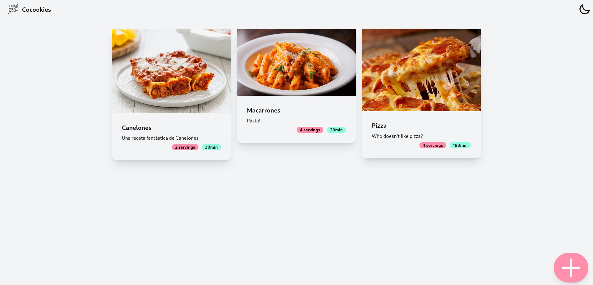

<picture>
    <source srcset="./resources/Cocookies.png" media="(prefers-color-scheme: dark)"/>
    
</picture>

<h1>Cocookies</h1>
A recipe manager made with Leptos

  

 
(image from the main menu of the application)

> [!WARNING]
> This project is work in progress, do not use this as your only site to save your recipes, data loss may occur.

# 🛠️ Using the Software
This software is being developed with the idea of it being used inside a Docker container, in particular It's being developed so that my girlfriend can store her recipes on our [CasaOS](https://www.casaos.io/) HomeServer.
You can find a working docker-compose for CasaOS on the `resources` subfolder in this repository. A Docker image is also [available](https://hub.docker.com/r/mariinkys/cocookies) if you want to try it out.

# 🧰 Contributing

Feel free to open pull requests, contributing in any way. I'm not by any means an expert in Leptos nor Rust and specially not Docker, so there may be better ways to handle things, again, feel free to contribute any way you like.

You can donate to help develop this and more projects here [Buy me a coffee](https://www.buymeacoffee.com/mariinkys)
