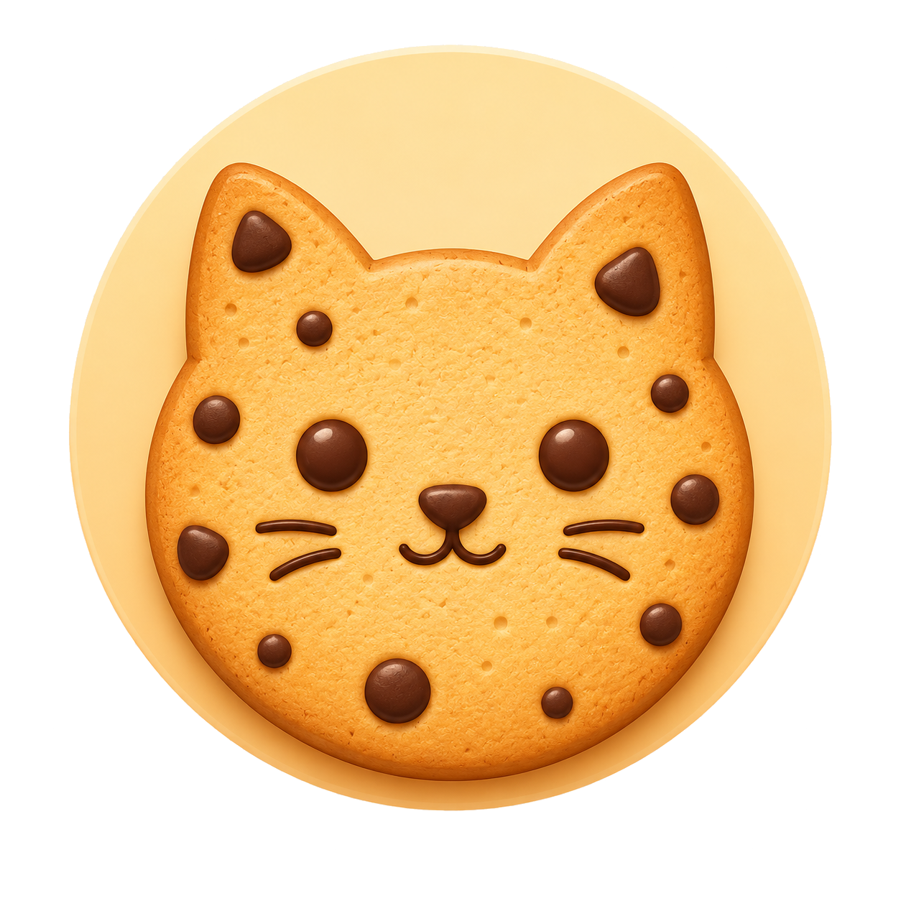

   
  
  <h1>Cocookies</h1>

<h3>A self-hostable recipe manager</h3>

## Features

- Multiple Users (can share recipes)
- Recipe Nutrition Info
- PDF Generation
- AI Import of recipes (from images, PDFs...)

And more

## About me

Check out my [other projects](https://github.com/mariinkys)

You can also help do this and more projects, [Buy me a Coffee](https://www.buymeacoffee.com/mariinkys)

## Copyright and Licensing

Copyright 2026 © Alex Marín

Released under the terms of the [GPL-3.0](./LICENSE)
